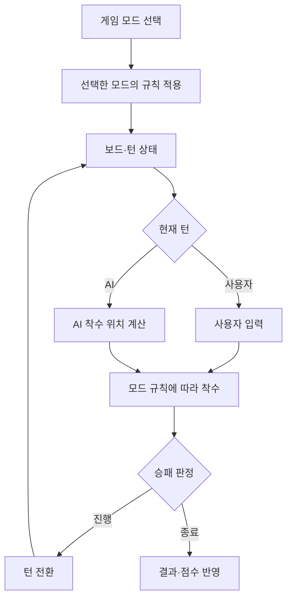
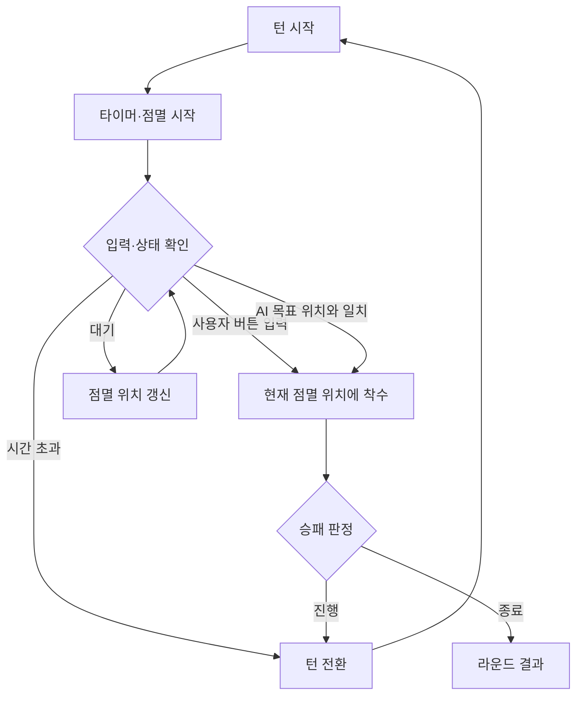

<div align="center">

<h1>TicTacToe AI & TicTac Snap</h1>

<p><strong>새로운 규칙으로 즐기는 틱택토, 탐색 방식으로 비교하는 게임 AI</strong></p>

<p>
3×3·4×4·5×5 틱택토와 다양한 변형 게임 모드를 구현하고,<br>
Full-Depth Minimax와 Depth-Limited Minimax의 성능을 비교한 프로젝트입니다.
</p>

<p>
  <a href="#주요-기능">주요 기능</a>
  &nbsp;·&nbsp;
  <a href="#게임-모드">게임 모드</a>
  &nbsp;·&nbsp;
  <a href="#기술-스택">기술 스택</a>
  &nbsp;·&nbsp;
  <a href="#ai-탐색-연구">AI 탐색 연구</a>
  &nbsp;·&nbsp;
  <a href="#연구-결과">연구 결과</a>
  &nbsp;·&nbsp;
  <a href="#실행-방법">실행 방법</a>
</p>

</div>

---

## 프로젝트 소개

기존 틱택토를 기반으로 **보드 크기 확장과 다양한 변형 규칙을 적용한 Flutter 게임 프로젝트**입니다.

일반적인 3×3 틱택토뿐 아니라 4×4·5×5 보드를 지원하며, 스피드런·순간 틱택토·역방향 틱택토와 같은 추가 게임 모드를 제공합니다.

게임에는 Minimax 기반 AI를 적용했습니다. 별도의 Python 실험에서는 보드 크기에 따른 탐색 비용을 확인하기 위해 **Full-Depth Minimax와 Depth-Limited Minimax의 실행 시간 및 승률을 비교**했습니다.

연구 결과를 바탕으로 학술 논문을 작성했으며, **한국정보기술전략혁신학회 학술대회 우수논문상**을 수상했습니다.

## 주요 기능

| 기능 | 설명 |
| --- | --- |
| **보드 크기 선택** | 일반 게임에서 3×3·4×4·5×5 보드 선택 |
| **AI 대전** | Minimax 기반 AI와 턴 방식으로 대전 |
| **변형 게임 모드** | 스피드런·순간 틱택토·역방향 틱택토 제공 |
| **라운드 관리** | 라운드별 턴과 사용자·AI 점수 관리 |
| **제한 시간** | 순간 틱택토에서 10초 타이머와 시간 초과 처리 |
| **결과 표시** | 라운드 승패와 최종 게임 결과 확인 |

### 게임 흐름

1. 일반 게임 또는 추가 게임 모드를 선택합니다.
2. 일반 게임에서는 보드 크기를 선택합니다.
3. 플레이어와 AI가 모드별 규칙에 따라 착수합니다.
4. 승패를 판정하고 게임 결과를 확인합니다.

## 게임 모드

### 일반 틱택토

기본 틱택토 규칙으로 AI와 대전합니다. **3×3·4×4·5×5** 보드를 선택할 수 있습니다.

보드가 커질수록 가능한 게임 상태가 증가하므로, AI의 탐색 범위와 상태 평가가 중요해집니다.

### 스피드런

각 플레이어가 보드 위에 유지할 수 있는 말의 개수를 제한한 모드입니다.

새로운 말을 놓으면 가장 먼저 놓았던 말이 제거됩니다. **Queue 구조로 배치 순서를 관리**하며, 현재 위치뿐 아니라 다음에 사라질 말도 고려해야 합니다.

### 순간 틱택토 · TicTac Snap

틱택토의 전략 요소에 **시간 제한과 순간적인 판단 요소**를 결합한 모드입니다.

빈칸 위치가 점멸하고, 사용자는 원하는 위치가 표시됐을 때 착수 버튼을 누릅니다.

| 요소 | 동작 |
| --- | --- |
| 점멸 | 착수할 수 있는 빈칸 위치 표시 |
| 사용자 입력 | 버튼을 누르면 현재 점멸 위치에 착수 |
| 제한 시간 | 10초 이내에 착수 |
| 시간 초과 | 다음 턴으로 전환 |
| AI 연동 | AI가 선택한 목표 위치와 점멸 위치를 연동 |
| 라운드 | 승패 판정 후 라운드 결과와 점수 반영 |

### 역방향 틱택토 · NoTacToe

일반 틱택토와 반대로 **먼저 자신의 말로 한 줄을 완성한 플레이어가 패배**합니다.

승패 조건이 뒤집히므로 자신의 줄을 완성하지 않으면서 상대의 선택지를 제한하는 전략이 필요합니다.

## 기술 스택

### App

<p>
  
  
  
</p>

Flutter Widget · StatefulWidget · Dart Timer

### AI & Algorithms

<p>
  
  
  
</p>

게임 트리 탐색 · 탐색 깊이 제한 · 보드 상태 평가

### Research

<p>
  
  
</p>

탐색 알고리즘 비교 · 실행 시간 측정 · Random AI 상대 승률 분석

### Game Logic

보드 상태 관리 · 턴 전환 · 승패 판정 · 라운드 점수 관리 · Queue 기반 말 배치 순서 관리

## 게임 동작 구조

아래는 게임의 주요 역할을 설명한 개념 구조입니다.



| 구성 | 역할 |
| --- | --- |
| **게임 화면** | 보드 표시, 모드 선택, 사용자 입력과 결과 표시 |
| **게임 상태** | 보드·현재 턴·라운드·점수 관리 |
| **모드별 규칙** | 말 제거, 점멸, 시간 제한, 역방향 승패 조건 적용 |
| **AI 플레이어** | 현재 보드를 평가하고 착수 위치 선택 |

Python 연구 실험은 Flutter 게임 실행과 별도로 진행합니다. 아래 연구 결과는 앱 화면의 응답 시간이나 기기별 실행 성능을 의미하지 않습니다.

## 순간 틱택토 동작 방식

사용자 입력과 타이머, AI의 목표 위치를 현재 턴에 맞춰 처리합니다.



- 사용자 턴에서는 착수 버튼 입력을 처리합니다.
- AI 턴에서는 계산한 목표 위치와 점멸 위치를 연동합니다.
- 착수 후에는 승패를 확인하고 다음 턴 또는 결과 화면으로 진행합니다.
- 제한 시간 안에 착수하지 못하면 턴을 전환합니다.

## AI 탐색 연구

보드 크기가 증가할수록 Minimax가 탐색해야 하는 게임 상태도 빠르게 증가합니다.

탐색 범위를 제한했을 때 실행 시간과 게임 성능이 어떻게 달라지는지 확인하기 위해 두 방식을 비교했습니다.

| 구분 | Full-Depth Minimax | Depth-Limited Minimax |
| --- | --- | --- |
| 탐색 범위 | 게임 종료 상태까지 탐색 | 정해진 깊이까지 탐색 |
| 상태 평가 | 종료 상태의 승패를 기준으로 평가 | 비종료 상태에 휴리스틱 평가 적용 |
| 특징 | 보드 확장 시 계산 비용이 크게 증가 | 탐색량을 줄일 수 있으나 평가 함수와 깊이에 영향을 받음 |

### 휴리스틱 평가

깊이 제한에 도달한 보드 상태를 평가해 다음 수를 선택합니다.

연구에서 사용한 평가 요소는 다음과 같습니다.

| 평가 요소 | 점수 |
| --- | ---: |
| 자신의 말 | +2 |
| 상대의 말 | -2 |
| 빈칸 | +1 |
| 승리에 가까운 상태 | 추가 가중치 |

## 실험 구성

Python 기반 Google Colab 환경에서 탐색 방식별 성능을 비교했습니다.

| 항목 | 내용 |
| --- | --- |
| 보드 크기 | 3×3, 4×4, 5×5 |
| 탐색 방식 | Full-Depth Minimax / Depth-Limited Minimax |
| 승률 비교 상대 | Random AI |
| 반복 횟수 | 조건별 50회 이상 |
| 주요 비교 지표 | 실행 시간, 승률 |

## 연구 결과

아래 수치는 **학술대회 논문에 보고된 팀 연구 결과**입니다. Flutter 앱 측정값이나 이후 별도로 수행한 재현 실험 결과와 구분합니다.

### 3×3 보드 실행 시간

| 탐색 방식 | 평균 실행 시간 |
| --- | ---: |
| Full-Depth Minimax | 3.63초 |
| Depth-Limited Minimax | 0.44초 |

깊이 제한·휴리스틱 탐색의 평균 실행 시간은 완전 탐색 대비 **약 87.9% 감소**했습니다. 실행 시간의 비율은 **약 8.25배**입니다.

### 확장 보드 결과

| 보드 크기 | Full-Depth 탐색 | Depth-Limited 평균 실행 시간 | Random AI 상대 승률 |
| --- | --- | ---: | ---: |
| 4×4 | 실험 환경에서 완료하기 어려움 | 2.89초 | 98% |
| 5×5 | 실험 환경에서 완료하기 어려움 | 36.94초 | 84% |

보드 확장에 따라 완전 탐색의 계산 부담이 커지는 반면, 깊이 제한 탐색은 탐색 범위를 줄여 4×4·5×5 환경에서도 실험을 수행할 수 있었습니다.

다만 깊이 제한 탐색 역시 보드가 커질수록 실행 시간이 증가했으며, 5×5에서는 평균 36.94초가 소요됐습니다. 또한 위 승률은 **Random AI를 상대로 한 해당 실험 조건의 결과**입니다.

## 연구 성과

**깊이탐색과 깊이제한 휴리스틱 기반 틱택토 AI 성능 비교 연구**

게임 구현과 탐색 알고리즘 비교 결과를 바탕으로 학술 논문을 작성했으며, **한국정보기술전략혁신학회 학술대회 우수논문상**을 수상했습니다.

주요 연구 내용은 다음과 같습니다.

- 보드 크기에 따른 탐색 비용 변화
- Full-Depth Minimax와 Depth-Limited Minimax 비교
- 휴리스틱 기반 보드 상태 평가
- 탐색 방식별 실행 시간 비교
- 확장 보드에서의 Random AI 상대 승률 분석

## 실행 방법

Flutter SDK와 Android 개발 환경이 필요합니다.

Flutter 프로젝트의 `pubspec.yaml`이 있는 디렉터리에서 실행합니다.

### 패키지 설치

```bash
flutter pub get
```

### 앱 실행

```bash
flutter run
```

Android Emulator 또는 연결된 실제 Android 기기에서 실행할 수 있습니다.

### Release APK 빌드

```bash
flutter build apk --release
```

생성 파일:

```text
build/app/outputs/flutter-apk/app-release.apk
```

---

<div align="center">

<p><strong>TicTacToe AI & TicTac Snap</strong></p>
<p>다양한 게임 규칙과 AI 탐색 방식을 함께 살펴보는 틱택토 프로젝트</p>

</div>
