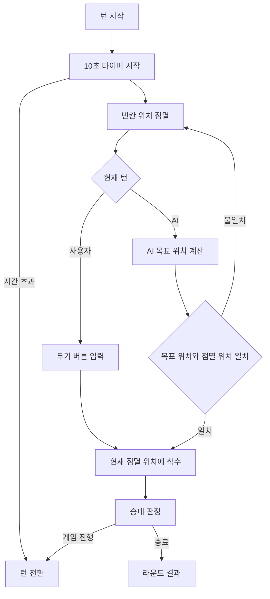
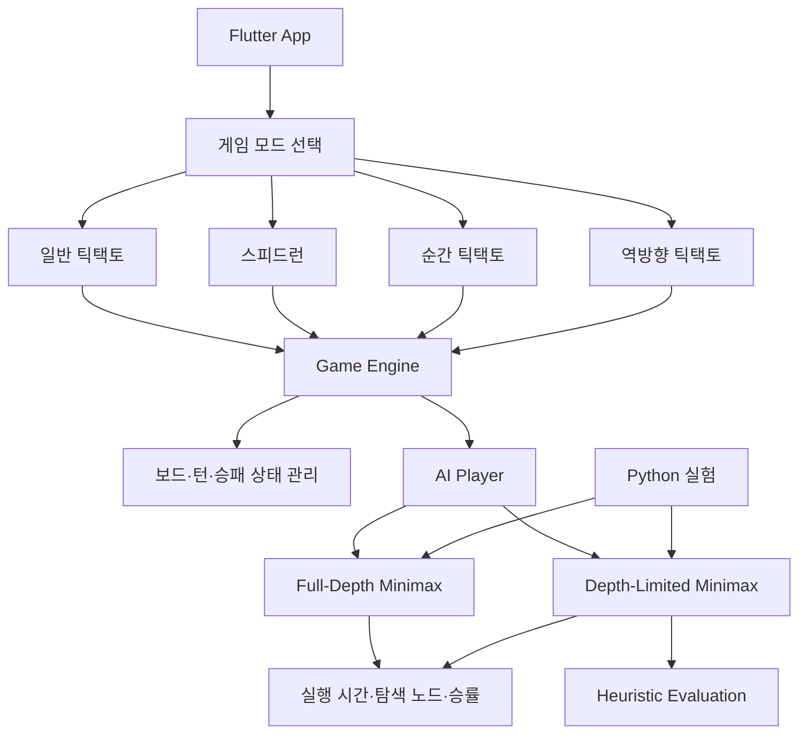

<div align="center">

<h1>TicTacToe AI & TicTac Snap</h1>

<p><strong>기본 틱택토에 새로운 규칙을 더하고, AI 탐색 성능을 비교한 Flutter 게임 프로젝트</strong></p>

<p>
3×3·4×4·5×5 틱택토와 다양한 변형 게임 모드를 구현하고,<br>
Full-Depth Minimax와 Depth-Limited Minimax의 성능을 비교했습니다.
</p>

<p>
  <a href="#주요-기능">주요 기능</a>
  &nbsp;·&nbsp;
  <a href="#게임-모드">게임 모드</a>
  &nbsp;·&nbsp;
  <a href="#ai-탐색-연구">AI 탐색 연구</a>
  &nbsp;·&nbsp;
  <a href="#연구-결과">연구 결과</a>
  &nbsp;·&nbsp;
  <a href="#실행-방법">실행 방법</a>
</p>

<br>

<p>
  
</p>

<p>
Flutter · Dart · Python · Google Colab
</p>

</div>

---

## 프로젝트 소개

기존 틱택토를 기반으로 **보드 크기 확장과 다양한 변형 규칙을 적용한 게임 프로젝트**입니다.

일반적인 3×3 틱택토뿐 아니라 4×4·5×5 보드를 지원하며, 스피드런·순간 틱택토·역방향 틱택토와 같은 추가 게임 모드를 구성했습니다.

게임 플레이에는 Minimax 기반 AI를 적용했으며, 보드 크기가 증가할수록 탐색 비용이 빠르게 커지는 문제를 확인하기 위해 **Full-Depth Minimax와 Depth-Limited Minimax의 성능을 비교**했습니다.

게임 구현과 AI 탐색 성능 분석 결과를 바탕으로 학술 논문을 작성했으며, **한국정보기술전략혁신학회 학술대회 우수논문상**을 수상했습니다.

---

## 주요 기능

| 기능 | 설명 |
| --- | --- |
| **보드 크기 선택** | 3×3·4×4·5×5 보드 중 하나를 선택하여 게임 진행 |
| **AI 대전** | Minimax 기반 AI와 턴 방식으로 대전 |
| **스피드런** | 새로운 말을 놓으면 오래된 말이 제거되는 변형 규칙 |
| **순간 틱택토** | 점멸하는 위치를 확인하고 제한 시간 안에 착수하는 반응형 모드 |
| **역방향 틱택토** | 먼저 한 줄을 완성한 플레이어가 패배하는 변형 모드 |
| **라운드 진행** | 라운드별 턴과 사용자·AI 점수 관리 |
| **제한 시간** | 순간 틱택토에서 10초 타이머와 시간 초과 처리 |
| **결과 표시** | 라운드 승패와 최종 게임 결과 표시 |

### 게임 흐름

1. 일반 게임 또는 추가 게임 모드를 선택합니다.
2. 일반 게임에서는 3×3·4×4·5×5 중 보드 크기를 선택합니다.
3. 플레이어와 AI가 번갈아 착수합니다.
4. 게임 모드별 규칙에 따라 승패를 판정합니다.
5. 라운드 결과와 최종 점수를 확인합니다.

---

## 게임 모드

### 일반 틱택토

기본적인 틱택토 규칙으로 AI와 대전합니다.

- 3×3
- 4×4
- 5×5

보드 크기가 증가할수록 가능한 게임 상태가 크게 늘어나기 때문에, AI 탐색 방식에 따른 성능 차이를 확인할 수 있습니다.

### 스피드런

각 플레이어가 보드 위에 유지할 수 있는 말의 개수를 제한한 모드입니다.

새로운 말을 배치하면 가장 먼저 놓았던 말이 제거되는 방식으로 진행되며, 말의 배치 순서를 관리하기 위해 Queue 구조를 활용했습니다.

### 순간 틱택토

기존 틱택토의 전략 요소에 **시간 제한과 순간적인 판단 요소**를 결합한 모드입니다.

빈칸이 일정한 흐름으로 점멸하며, 사용자는 원하는 위치가 표시됐을 때 `두기` 버튼을 눌러 착수합니다.

- 빈칸 위치 점멸
- 10초 제한시간
- 사용자 착수 처리
- 시간 초과 시 턴 전환
- AI가 선택한 목표 위치와 점멸 흐름 연동

### 역방향 틱택토

일반 틱택토와 반대로 **먼저 자신의 말로 한 줄을 완성한 플레이어가 패배**합니다.

동일한 보드를 사용하지만 승패 조건이 바뀌기 때문에 일반 모드와 다른 전략이 필요합니다.

---

## 순간 틱택토 동작 방식



---

## 기술 스택

| 영역 | 사용 기술 |
| --- | --- |
| 언어 | Dart, Python |
| 앱 개발 | Flutter |
| UI | Flutter Widget |
| 상태 관리 | StatefulWidget |
| 타이머 | Dart Timer |
| 게임 로직 | 턴 관리, 착수 처리, 승패 판정 |
| AI | Minimax, Depth-Limited Minimax |
| 상태 평가 | Heuristic Evaluation |
| 데이터 구조 | Queue |
| 실험 | Python, Google Colab |
| 분석 지표 | 실행 시간, 탐색 노드 수, 승률 |
| 플랫폼 | Android |

---

## 시스템 구조



---

## AI 탐색 연구

보드 크기가 증가할수록 Minimax가 탐색해야 하는 상태 공간도 빠르게 증가합니다.

이러한 계산 비용의 차이를 확인하기 위해 두 가지 탐색 방식을 비교했습니다.

### Full-Depth Minimax

게임이 종료되는 상태까지 가능한 경우의 수를 탐색하여 최적의 수를 선택합니다.

상태 공간이 작은 환경에서는 안정적으로 동작하지만, 보드 크기가 커질수록 탐색해야 하는 경우의 수가 크게 증가합니다.

### Depth-Limited Minimax

전체 게임 트리를 끝까지 탐색하지 않고 **일정 깊이까지만 탐색한 후 현재 상태를 평가**합니다.

휴리스틱 평가를 이용하여 제한된 탐색 범위에서도 유리한 수를 선택하도록 구성했습니다.

| 평가 요소 | 점수 |
| --- | ---: |
| 자신의 말 | +2 |
| 상대의 말 | -2 |
| 빈칸 | +1 |
| 승리에 가까운 상태 | 추가 가중치 |

---

## 실험 구성

AI 탐색 방식에 따른 차이를 확인하기 위해 Python 기반 Google Colab 환경에서 실험을 진행했습니다.

| 항목 | 내용 |
| --- | --- |
| 보드 크기 | 3×3, 4×4, 5×5 |
| 탐색 방식 | Full-Depth Minimax / Depth-Limited Minimax |
| 비교 상대 | Random AI |
| 반복 횟수 | 조건별 50회 이상 |
| 평가 지표 | 실행 시간, 탐색 노드 수, 승률 |

---

## 연구 결과

### 3×3 보드 실행 시간

| 탐색 방식 | 평균 실행 시간 |
| --- | ---: |
| **Full-Depth Minimax** | 3.63초 |
| **Depth-Limited Minimax** | 0.44초 |

3×3 보드에서는 깊이 제한 탐색의 평균 실행 시간이 **3.63초에서 0.44초로 감소**했습니다.

이는 Full-Depth 탐색 대비 **87.9% 감소**, 약 **8.25배 빠른 처리 속도**에 해당합니다.

### 확장 보드 결과

| 보드 크기 | Full-Depth | Depth-Limited 평균 실행 시간 | Limited AI 승률 |
| --- | ---: | ---: | ---: |
| **3×3** | 3.63초 | 0.44초 | 100% |
| **4×4** | 처리 어려움 | 2.89초 | 98% |
| **5×5** | 처리 어려움 | 36.94초 | 84% |

보드 크기가 증가하면서 Full-Depth 탐색의 계산 부담은 크게 증가했지만, Depth-Limited 탐색은 확장된 보드에서도 대국을 완료하며 Random AI를 상대로 높은 승률을 기록했습니다.

> 위 수치는 학술대회 논문에 보고된 팀 공식 실험 결과입니다.

---

## 연구 결과 해석

실험을 통해 보드가 커질수록 전체 게임 트리를 탐색하는 방식의 계산 비용이 빠르게 증가하는 것을 확인했습니다.

반면 탐색 깊이를 제한하고 중간 상태를 휴리스틱으로 평가하는 방식은 전체 탐색 범위를 줄이면서도 게임 플레이에 필요한 전략적 판단을 유지할 수 있었습니다.

특히 3×3 환경에서는 실행 시간을 크게 줄였으며, 4×4와 5×5에서도 각각 98%, 84%의 승률을 기록했습니다.

---

## 프로젝트 구조

프로젝트는 크게 Flutter 게임 화면, 게임 엔진, AI 플레이어와 실험 코드로 구성됩니다.

```text
Flutter App
├─ UI / Pages
├─ Game Engine
├─ Game Modes
│  ├─ Normal
│  ├─ Speedrun
│  ├─ TicTac Snap
│  └─ NoTacToe
├─ AI Player
│  ├─ Minimax
│  └─ Depth-Limited Search
└─ Research
   └─ Python / Google Colab
```

> 실제 디렉터리 이름은 저장소 구조를 기준으로 확인할 수 있습니다.

---

## 실행 방법

Flutter SDK와 Android 개발 환경이 필요합니다.

### 패키지 설치

```bash
flutter pub get
```

### 앱 실행

```bash
flutter run
```

Android Emulator 또는 연결된 실제 Android 기기에서 실행할 수 있습니다.

### Release APK 빌드

```bash
flutter build apk --release
```

생성 파일:

```text
build/app/outputs/flutter-apk/app-release.apk
```

---

## 연구 성과

### 깊이탐색과 깊이제한 휴리스틱 기반 틱택토 AI 성능 비교 연구

게임 구현과 AI 탐색 성능 비교 결과를 바탕으로 학술 논문을 작성했습니다.

**한국정보기술전략혁신학회 학술대회 우수논문상**을 수상했습니다.

연구에서는 다음 내용을 다뤘습니다.

- Full-Depth Minimax와 Depth-Limited Minimax 비교
- 보드 크기에 따른 탐색 비용 변화
- 휴리스틱 기반 상태 평가
- 실행 시간 비교
- Random AI 상대 승률 비교
- 확장 보드 환경에서의 탐색 효율 분석

---

## Screenshots

### 일반 게임

<!--
<p align="center">
  
  
</p>
-->

### 추가 게임 모드

<!--
<p align="center">
  
  
  
</p>
-->

> 실제 게임 화면 이미지는 저장소 이미지 경로에 맞게 추가할 예정입니다.
